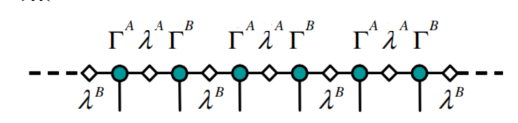
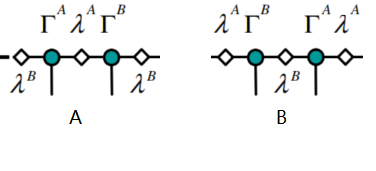
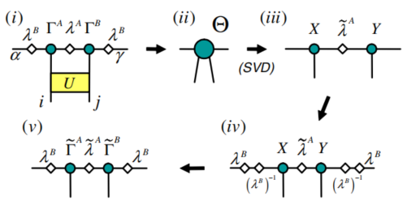
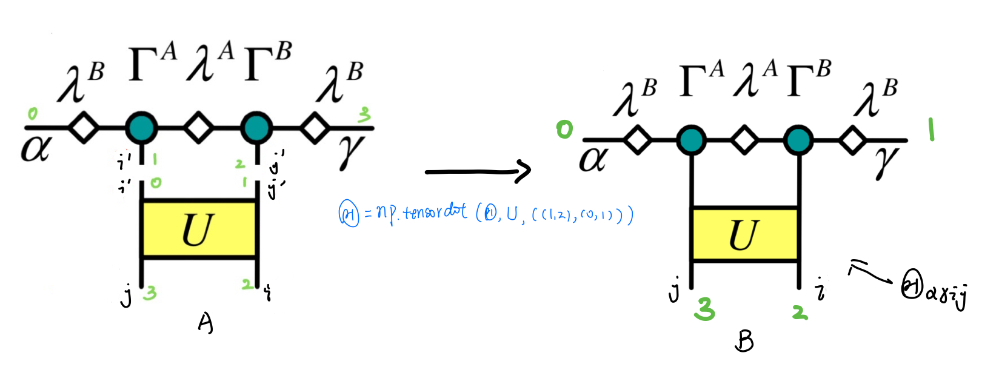
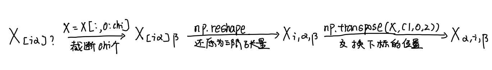
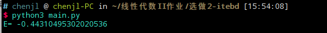

# ITEBD计算一维无限长自旋1/2海森堡链

## 一、算法介绍

### 1.1 基本原理

ITEBD(Imaginary Time Evolution Block Decimation)是一种类似幂法(power method)的方法，其基本原理是利用虚时间演化逐步过滤掉高能态（实践过程中，我们利用奇异值分解扔掉奇异值较小的部分），最终只剩下基态。

具体来讲，虚时间演化算符是$e^{-\tau\hat{H}}$，（随机）初始波函数$\Psi_0$可以被表示为
$$
\Psi_0=\sum_i c_i\phi_i
$$
其中${\phi_i}$是本征态。虚时间演化算符作用初始波函数后有：
$$
e^{\tau\hat{H}}\Psi_0=\sum_i c_ie^{-\tau E_i}\phi_i
$$
容易见得，能级越高的态随着虚时间演化会越快的趋于0，最终会只剩下基态。在实际计算过程中，为了避免数值不稳定，每作用一次虚时间演化算符后需要归一化一下波函数，即：
$$
\Psi_{\tau}=\frac{exp(-\tau H)\Psi_0}{||exp(-\tau H)\Psi_0||}
$$

### 1.2 算法介绍

#### 1.2.1对象的构建/选择

在解决问题之前首先需要确定问题的对象，ITEBD算法的对象是张量网络。

1. 将体系波函数表示为MPS(Matrix Product State)形式$^{[1]}$；



2. 由于体系的平移不变性，我们只需要储存如下图A、B两个节点（实际上只需储存$\lambda^A$、$\lambda^B$;$\Gamma^A$、$\Gamma^B$即可），并只需要对这两个“代表“操作即可更新全链;



#### 1.2.2 流程

ITEBD的流程可以用一张图概况如下$^{[1]}$：



重复上述循环多次即可得到近似基态波函数，进而可以计算基态能量。下阐述每一步的具体含义：

1. 将虚时间演化算符$U$作用于张量网络，将其变成单个四阶张量$\Theta_{\alpha ij \gamma}$;
2. 将四阶张量$\Theta_{\alpha ij \gamma}$“脚”两两合并，得到二阶张量$\Theta_{[\alpha i],[j \gamma]}$，并对其进行奇异值分解，保留最大的$\chi$个奇异值，相应的，得到$X_{[\alpha i]\beta}$、$\lambda_{\beta}$和$Y_{\beta[j\gamma]}$;
3. 将二阶张量$X$和$Y$的"脚"分开，得到三阶张量$X_{\alpha i \beta}$、$Y_{\beta j \gamma}$;
4. 将$(\lambda^B)^{-1}$与$X$、$Y$缩并，得到新的$\Gamma^A$和$\Gamma^B$,至此完成一次循环，到达上图$(v)$的状态。

值得注意的是，$U$作用的顺序并不是一直左脚在$\Gamma^A$，右脚在$\Gamma^B$,而是要依次交替（具体会在具体实现中结合代码解释）。

## 二、具体实现

### 2.1 核心代码

核心代码如下：

```python
def itebdForCalculateHessenbergModelGroundStateEnergy(chi,T):
    # 参量解释：
    # chi:在论文[1]中是Schmidt分解的rank，也可以认为是做奇异值分解后保留的奇异值的个数。
    # T: 虚时间演化的总长度。
    deltaT=0.01 #这个是每次演化的时间间隔
    loopTimes=int(T/deltaT)  #T/deltaT是循环的次数
ss
    Gama=np.random.rand(2,chi,2,chi) #Gamma，第一个维度是用于区别Gamma^A和Gamma^B的，剩余三个维度如图所示，是它的三个脚
    Lambda=np.random.rand(2,chi) #Lambda，第一个维度是区别A和B的，第二个维度储存的是对角元(Gamma是对角的)

    H = np.array([[0.25,0,0,0],
                 [0,-0.25,0.5,0],
                 [0,0.5,-0.25,0],
                 [0,0,0,0.25]])

    w,v = np.linalg.eig(H)
    U=np.dot(np.dot(v,np.diag(np.exp(-deltaT*(w)))),np.transpose(v)) #U=e^{tH}=vwv^\dagger
    U=np.reshape(U,(2,2,2,2)) #将U从二阶张量拆成四阶张量（|sigma_1 sigma_2> ->|sigma_1>|sigma_2>）

    E=0
    # 接下来部分是ITEBD的主要部分，流程大体如上1.2.2所示
    for i in range(loopTimes):
        # 首先判断目前是奇数次循环还是偶数次循环，相应的确定A、B；实现轮流更新两个基本的平移单元
        A=np.mod(i,2)
        B=np.mod(i+1,2)

        #construct the tensor network
        Theta=np.tensordot(np.diag(Lambda[B,:]),Gama[A,:,:,:],axes=(1,0))
        Theta=np.tensordot(Theta,np.diag(Lambda[A,:]),axes=(2,0))
        Theta=np.tensordot(Theta,Gama[B,:,:,:],axes=(2,0))
        Theta=np.tensordot(Theta,np.diag(Lambda[B,:]),axes=(3,0))

        #apply U,contract the tensor network into a single tensor \Theta_{\alpha i j \gamma}
        Theta=np.tensordot(Theta,U,axes=((1,2),(0,1)))

        #svd
        Theta=np.reshape(np.transpose(Theta,(2,0,3,1)),(chi*2,2*chi))
        X,newLambda,Y=np.linalg.svd(Theta)
        # print(newLambda)

        #contract the Lambda: Truncate the lambda and renormalization
        Lambda[A,:]=newLambda[0:chi]/np.sqrt(np.sum(newLambda[0:chi]**2))
        # print(np.sum(Lambda[A,]**2))

        #construct X,introduce lambda^B back into the network
        X=X[0:2*chi,0:chi]
        X=np.reshape(X,(2,chi,chi))
        X=np.transpose(X,(1,0,2))
        Gama[A,:,:,:]=np.tensordot(np.diag(Lambda[B,:]**(-1)),X,axes=(1,0))

        #construct Y,introduce lambda^B back into the network
        Y=Y[0:chi,0:2*chi]
        Y=np.reshape(Y,(chi,2,chi))
        Gama[B,:,:,:]=np.tensordot(Y,np.diag(Lambda[B,:]**(-1)),axes=(2,0))

        #判断目前是否是最后两次循环，若是则根据波函数估算能量并记录
        if(i>=loopTimes-2):
            E+=-np.log(np.sum(Theta**2))/(deltaT*2)
            # print("loop times:",i,"E =", -np.log(np.sum(Theta**2))/(deltaT*2))

    # print("E=",E/2)
    return E/2
```

### 2.2 要点说明

#### 2.2.1 U作用到波函数之后张量“脚”的问题（对应流程图的$(i)-(ii)$）



当使用`Theta=np.tensordot(Theta,U,axes=((1,2),(0,1)))`将$i'$和$j'$缩并掉之后，$\Theta_{\alpha i j \gamma}$变成了$\Theta_{\alpha \gamma i j}$(numpy.tensordot的结果)，为了下面svd是把$\alpha$、$i$放在一起，$j$、$\gamma$放在一起，需要先进行一个“转置”，在numpy中，我们使用`np.transpose(Theta,(2,0,3,1))`将$\Theta_{\alpha \gamma i j}$变成了$\Theta_{i \alpha j \gamma}$，紧接着用$np.reshape(...)$将$\Theta_{i \alpha j \gamma}$变成了$\Theta_{[i\alpha][j\gamma]}$，便于下面的奇异值分解。

#### 2.2.2 奇异值分解的处理（对应流程图$(iii)-(iv)$）

$(ii)->(iv)$我们将对$\Theta_{[i\alpha][j\gamma]}$进行奇异值分解，有：
$$
\Theta_{[i\alpha][j\gamma]}=X_{[i\alpha]?}S_?Y_{?[j\gamma]}
$$
截断到$\chi$个最大奇异值，有:
$$
\Theta_{[i\alpha][j\gamma]}=X_{[i\alpha]\beta}S_\beta Y_{\beta[j\gamma]}
$$
现在主要问题是怎么从$X_{[i\alpha]?}$的形式回到X的三阶张量形式，下以$X$为例演示我的方法：



用类似的方法，我们很容易得到$Y$、$\lambda$的变换方式，实现从$(ii)->(iv)$

#### 2.2.3 波函数的归一化

理论上可以证明，体系的波函数可以被表示为MPS的形式，即：
$$
\Psi_{...\sigma_i \sigma_{i+1}\sigma_{i+2}\sigma_{i+3}...=...A^{\sigma_i}\Sigma^AB^{\sigma_{i+1}}\Sigma^B...}
$$
由于$A^{\sigma_{i}}$和$B^{\sigma_{i+1}}$都是left-normalized matrix（i. e. $\sum_{\sigma_l} A^{\sigma_l \dagger}A^{\sigma_l}=I$）,只要$\Sigma^i$满足$tr(\Sigma^{i\dagger}\Sigma^i)=1,i=A、B$，便有$\Psi$是归一的。

在实际编程过程中，我们只需让截断后的$\lambda$归一化即可:`Lambda[A,:]=newLambda[0:chi]/np.sqrt(np.sum(newLambda[0:chi]**2))`.

#### 2.2.4 基态能量的估计

估计基态能量的理论依据是$\Theta=e^{-\tau h}\Psi\approx e^{-\tau E_0}\Psi$,由于$\Psi$是归一的，所以有$\Theta^2=e^{-2\tau E_0}\Psi^2=e^{-2\tau E_0}$，即
$$
E_0=-ln(\Theta^2)/(2\tau)
$$
在实践过程中，我们对最后两次循环（分别对应最后的A和B）估算能量，分别记为$E_A$和$E_B$，取$E_{final}=\frac{E_A+E_B}{2}$作为最终的能量。

## 运行结果

linux(测试环境：Deepin 15.11)下运行结果如下图所示（$\chi=30;T=200;\Delta T=0.01$）:



>filename: a.d
>
>....
>
>D = 64,  -0.443183560507177   -0.44318356050735*****  99000  *****

与理论值$-ln2+\frac{1}{4}\approx-0.44314718055995$相比，误差在$10^{-5}$量级；与群文件中的`a.d`相比，精确程度相当（都与理论值的误差在$10^{-5}$量级）。由此可见，程序的结果应该是正确的。

### 参考文献

[1] Vidal G . Classical simulation of infinite-size quantum lattice systems in one spatial dimension[J]. Physical Review Letters, 2007.
